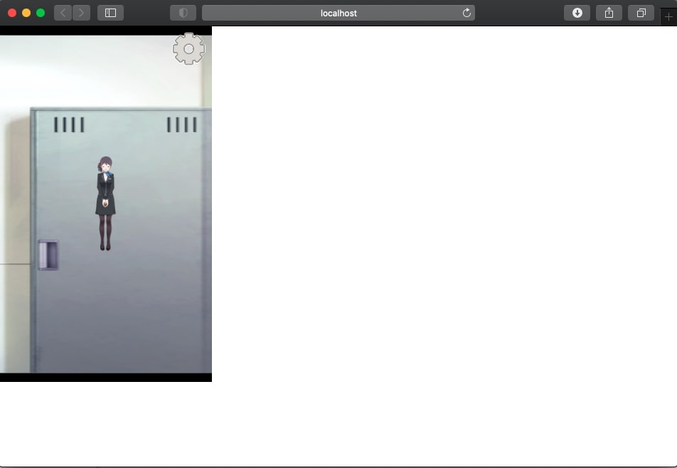

# Live2D のモデルを React + TypeScript で動かす

業務で Live2D のモデルを Web 上に表示するアプリを作成する検討をしていました。
Live2D 用の npm パッケージは公式から提供されておらず、React などのフレームワークに組み込む事例がなかなか見当たらなかったので、知見をまとめていきたいと思います。

# 作成したもの

Live2D のモデルを表示させるアプリです。マウス操作に反応したり、モデルが切り替わったりします。サンプルのものをそのまま表示しているだけともいいます笑

# 必要となるもの

- Node.js
- React.js
- TypeScript
- Live2D (Cubism 4 SDK for Web)
- Live2D モデル

Live2D のモデルは公式のサンプルを使っていきます。独自のモデルを用意するのが一番ハードル高いですね…

# 作成手順

プロジェクトの作成から以下に記載していきます。

# ベースとなるプロジェクト作成

create-react-app から作る場合、Babel の設定をいじる必要があります。
Babel の設定を変更するには、eject するか react-app-rewired を導入するかのどちらかが必要です。
eject するくらいなら一から作ろうと思い、空の状態から React のプロジェクトを作成しました。

## Webpack + TypeScript + React のプロジェクト作成

Web で探すと多数出てきますが、備忘録を兼ねて記述しておきます。
前提として、npm または yarn コマンドが使えることと、VSCode が入っているものとします。

まずはプロジェクトフォルダを作成し、VSCode でプロジェクトを開きます。

```
mkdir -p live2d-react-sample
cd ./live2d-react-sample
code .
```

VSCode でターミナルを開き、npm を初期化します。これをしないと package.json が作成されず、`npm install -D`を正常に記録できなくなってしまいます。

```
npm init -y
```

次に、必要なモジュールをインストールしていきます。
1 つ目のインストールコマンドで webpack と TypeScript のモジュールをインストールしています。
public 内の index.html から webpack でコンパイルしたら dist 以下に index.html を出力してほしかったので、html-webpack-plugin も入れています。
2 つ目と 3 つ目 React のモジュールと型定義をインストールします。
型定義ファイルはビルド後の動作には不要なので`-D`オプションでインストールします。

```
npm i -D webpack webpack-cli webpack-dev-server html-webpack-plugin typescript ts-loader
npm i -S react react-dom
npm i -D @types/react @types/react-dom
```

実際に動かしたときのバージョンは以下です。バージョン以外の情報は除いています。
Webpack 関連モジュールのバージョンの組み合わせによっては`Cannot find module 'webpack-cli/bin/config-yargs'`というエラーが出るので、その場合は下記のバージョンなりバージョンを変更して試すのがおすすめです。

```json:title=package.json
{
  "dependencies": {
    "react": "^17.0.1",
    "react-dom": "^17.0.1"
  },
  "devDependencies": {
    "@types/react": "^16.9.56",
    "@types/react-dom": "^16.9.9",
    "html-webpack-plugin": "^4.5.0",
    "ts-loader": "^8.0.11",
    "typescript": "^4.0.5",
    "webpack": "^4.41.5",
    "webpack-cli": "^3.3.10",
    "webpack-dev-server": "^3.10.1"
  }
}
```

次に、必要なファイルを作成していきます。

```
mkdir public src
touch webpack.config.js tsconfig.json
touch src/index.tsx src/App.tsx public/index.html
```

webpack.config.js の設定を記載します。

```js:title=webpack.config.js
var path = require('path');
const htmlWebpackPlugin = require('html-webpack-plugin');

module.exports = {
  mode: 'development',
  entry: './src/index.tsx',
  output: {
    path: path.resolve(__dirname, 'dist'),
    filename: 'static/js/bundle.js',
  },
  resolve: {
    extensions: ['.ts', '.tsx', '.js', '.jsx'],
  },
  module: {
    rules: [
      {
        test: /\.(ts|tsx)$/,
        exclude: /node_modules/,
        loader: 'ts-loader',
      },
    ],
  },
  plugins: [
    new htmlWebpackPlugin({
      template: 'public/index.html',
    }),
  ],
  devServer: {
    contentBase: path.resolve(__dirname, 'public'),
    watchContentBase: true,
    inline: true,
    hot: true,
    open: true,
    port: 3000,
    compress: true,
    writeToDisk: true,
  },
  devtool: 'inline-source-map',
};
```

tsconfig.json の設定は以下の通りです。

```json:title=tsconfig.json
{
  "compilerOptions": {
    "target": "es5",
    "moduleResolution": "node",
    "allowJs": true,
    "jsx": "react",
    "esModuleInterop": true,
    "experimentalDecorators": true,
    "forceConsistentCasingInFileNames": true,
    "outDir": "./dist",
    "removeComments": true,
    "sourceMap": true,
    "baseUrl": "./"
  }
}
```

package.json の scripts にデバッグ用とビルド用のコマンドを記載していきます。

```json:title=package.json
{
  "scripts": {
    "start": "webpack-dev-server",
    "build": "webpack -d --hide-modules",
    "build:prod": "webpack -p --hide-modules",
    "test": "tsc --noEmit"
  }
}
```

public/index.html の中身を記載していきます。

```html:title=public/index.html
<!DOCTYPE html>
<html>
  <head>
    <meta charset="utf-8" />
    <meta name="viewport" content="width=1900" />
    <title>TypeScript HTML App</title>
  </head>
  <body>
    <div id="root"></div>
  </body>
</html>
```

index.tsx の中身を記載していきます。

```tsx:title=src/index.tsx
import React from 'react';
import ReactDOM from 'react-dom';
import App from './App';

ReactDOM.render(<App />, document.getElementById('root'));
```

App.tsx の中身を記載していきます。

```tsx:title=src/App.tsx
import React, { useState, useEffect } from 'react';
import ReactLive2d from './live2d';

const App: React.FC = () => {
  return <div>Hello World!</div>;
};
export default App;
```

ここまでで、フォルダ構成は以下のようになります。

```
live2d-react-sample/
　├ node_modules/
　├ public/
　│　└ index.html
　├ src/
　│　├ App.tsx
　│　└ index.tsx
　├ .gitignore
　├ package-lock.json
　├ package.json
　└ tsconfig.json
　└ webpack.config.js
```

`npm start`または`yarn start`でブラウザに`Hello World!`と表示されていれば構築完了です。

# Live2D の導入

環境構築ができたので、ここから Live2D の導入をしていきます。
Live2D の SDK は、[Cubism SDK for Web のダウンロードページ](https://www.live2d.com/download/cubism-sdk/#sdk3)より入手します。

## React プロジェクトに導入

live2d-react-sample の src 直下に Live2D の SDK を格納するフォルダを作成します。
また、Live2D 内で`whatwg-fetch`を使用しているため、モジュールをインストールしておきます。

```
mkdir ./src/live2d
npm install whatwg-fetch
```

SDK のファイルの中で Core と Framework のフォルダと、Samples/TypeScript/Demo/src にあるファイル一式および Samples/Resources にあるファイル一式を以下のフォルダ構成になるよう格納します。

```
live2d-react-sample/
　├ node_modules/
　├ public/
　│　├ Core/
　│　├ Resources/
　│　└ index.html
　├ src/
　│　├ live2d/
　│　│ 　├ Framework/
　│　│ 　├ lappdefine.ts
　│　│ 　├ lappdelegate.ts
　│　│ 　├ lapplive2dmanager.ts
　│　│ 　├ lappmodel.ts
　│　│ 　├ lapppal.ts
　│　│ 　├ lappsprite.ts
　│　│ 　├ lapptexturemanager.ts
　│　│ 　├ lappview.ts
　│　│ 　├ main.ts
　│　│ 　├ touchmanager.ts
　│　│ 　└ Framework/
　│　├ App.tsx
　│　└ index.tsx
　├ .gitignore
　├ package.json
　├ README.md
　├ tsconfig.json
　└ yarn.lock
```

## 参照の解決

lappdelegate.ts などのファイル内で、Framework のファイルを`@framework/live2dcubismframework`などエイリアス指定して呼び出しています。
そのため、tsconfig.json でエイリアスのパスを追加します。

```json:title=tsconfig.json
{
  "compilerOptions": {
    ...
    "paths": {
      "@framework/*": ["./src/live2d/Framework/src/*"]
    }
  }
}
```

Webpack でもエイリアスの名前解決ができるように設定を追加します。

```js:title=webpack.config.js
var path = require('path');
const htmlWebpackPlugin = require('html-webpack-plugin');

module.exports = {
  /*省略*/
  resolve: {
    extensions: ['.ts', '.tsx', '.js', '.jsx'],
    alias: {
      '@framework': path.resolve(__dirname, 'src/live2d/Framework/src'),
    },
  },
  /*省略*/
};
```

## live2d 呼び出し用 index.tsx 作成

次に、live2d フォルダ内に index.tsx を作成します。
これにより、App.tsx などから`import RenderLive2D from './live2d'`とファイル名を省力して記載できるようになります。

```tsx:title=src/live2d/index.tsx
import { LAppDelegate } from './lappdelegate';
import * as LAppDefine from './lappdefine';
import React, { useEffect } from 'react';

type Prop = {
  top?: string;
  right?: string;
  bottom?: string;
  left?: string;
  PathFull?: string;
  MobileShow?: boolean;
  release?: boolean;
  width?: string;
  height?: string;
  ModelName?: string;
};

const RenderLive2d: React.FC<Prop> = (props) => {
  let containerStyle: React.CSSProperties = {
    position: 'fixed',
    top: props.top ? props.top : '',
    right: props.right ? props.right : '0',
    bottom: props.bottom ? props.bottom : '0',
    left: props.left ? props.left : '',
    width: props.width ? props.width : window.innerWidth,
    height: props.height ? props.height : window.innerHeight,
  };

  let canvasStyle: React.CSSProperties = {
    position: 'relative',
    top: props.top ? props.top : '',
    right: props.right ? props.right : '0',
    bottom: props.bottom ? props.bottom : '0',
    left: props.left ? props.left : '',
  };

  useEffect(() => {
    if (!navigator.userAgent.match(/mobile/i) || props.MobileShow == true) {
      if (LAppDelegate.getInstance().initialize() == false) {
        return;
      }
      LAppDelegate.getInstance().run();
    }
  }, []);

  useEffect(() => {
    if (props.release == true) {
      LAppDelegate.releaseInstance();
    }
  }, [props.release]);

  return (
    <div>
      <div style={containerStyle} id='live2d-container'>
        <div
          id='live2d-hidden'
          style={{
            width: '100%',
            height: '100%',
            position: 'absolute',
            top: '0',
            left: '0',
            zIndex: 2,
          }}
        ></div>
        <canvas
          id='live2d'
          style={canvasStyle}
          width={props.width ? props.width : '300'}
          height={props.height ? props.height : '500'}
          className='live2d'
        ></canvas>
      </div>
    </div>
  );
};

export default RenderLive2d;
```

## lappdelegate.ts の修正

次に、lappdelegate.ts で WebGL を描画するための canvas を作成するよう修正します。

以下のコードでは、元々のキャンバスを生成する処理をコメントアウトし、initialize で id タグに live2d とついた HTMLCanvasElement を取得し、canvas に WebGL の設定を付与していくよう変更しています。

```ts:title=lappdelegate.ts
  /**
   * APPに必要な物を初期化する。
   */
  public initialize(): boolean {
    // キャンバスの作成
    //canvas = document.createElement('canvas');
    //canvas.width = LAppDefine.RenderTargetWidth;
    //canvas.height = LAppDefine.RenderTargetHeight;

    //[追加]
    canvas = <HTMLCanvasElement>document.getElementById("live2d");

    // glコンテキストを初期化
    // @ts-ignore
    gl = canvas.getContext('webgl') || canvas.getContext('experimental-webgl');

    if (!gl) {
      alert('Cannot initialize WebGL. This browser does not support.');
      gl = null;

      document.body.innerHTML =
        'This browser does not support the <code>&lt;canvas&gt;</code> element.';

      // gl初期化失敗
      return false;
    }

    // キャンバスを DOM に追加
    //document.body.appendChild(canvas);

    /* 以下省略 */
  }
```

## React に組み込み

App.tsx からは以下のようにして呼べるようにします。

```tsx:title=App.tsx
import React, { useState, useEffect } from 'react';
import RenderLive2d from './live2d';

const App: React.FC = () => {
  return (
    <div>
      <RenderLive2d />
    </div>
  );
};
export default App;
```

## 実行

ここまでの修正が完了したら、`npm start`で動作確認します。

以下のようにレンダリングされていれば完成です。



# 参考

- [JavaScript から Web 版 SDK を使う](https://docs.live2d.com/cubism-sdk-tutorials/use-sdk-in-js/?locale=ja)  
  公式のマニュアルです。使い方が分からなくなったらとりあえずこのページを見ていました。

- [有志の react-live2d パッケージ](https://github.com/chendishen/react-live2d)  
  React と Live2D を組み合わせる際、こちらのソースコードが非常に参考になりました。
